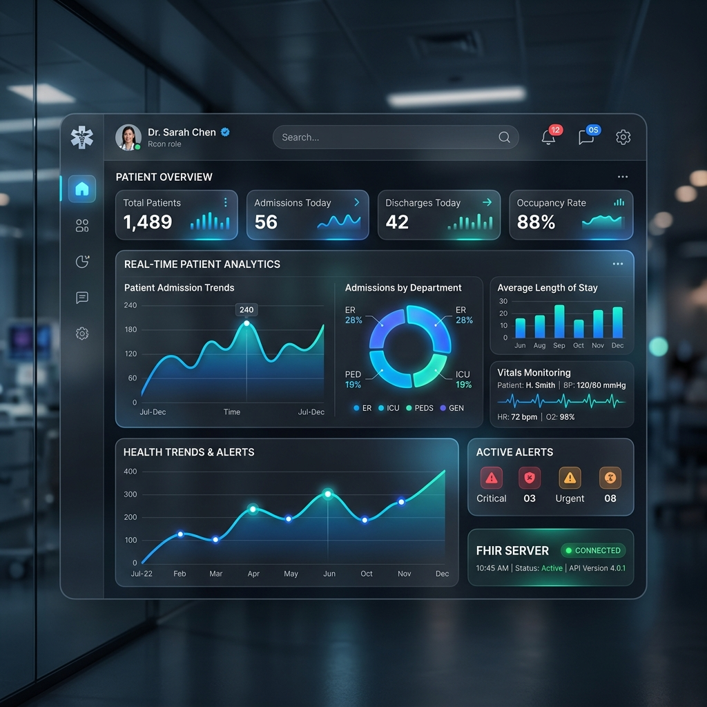
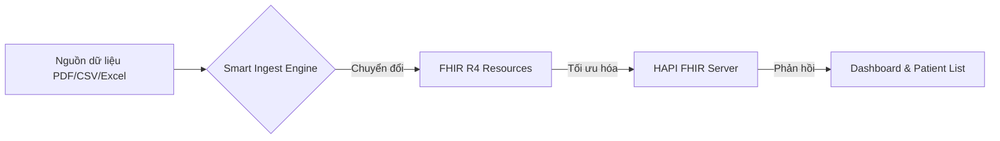
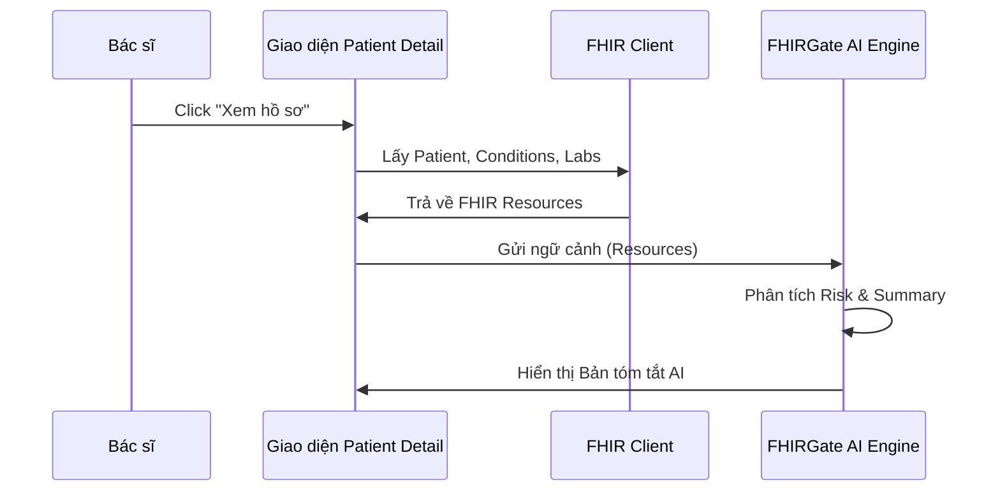
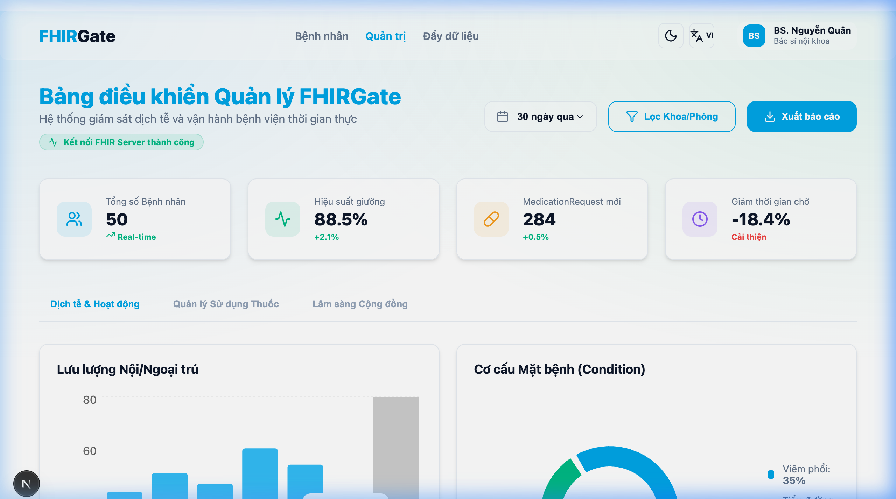
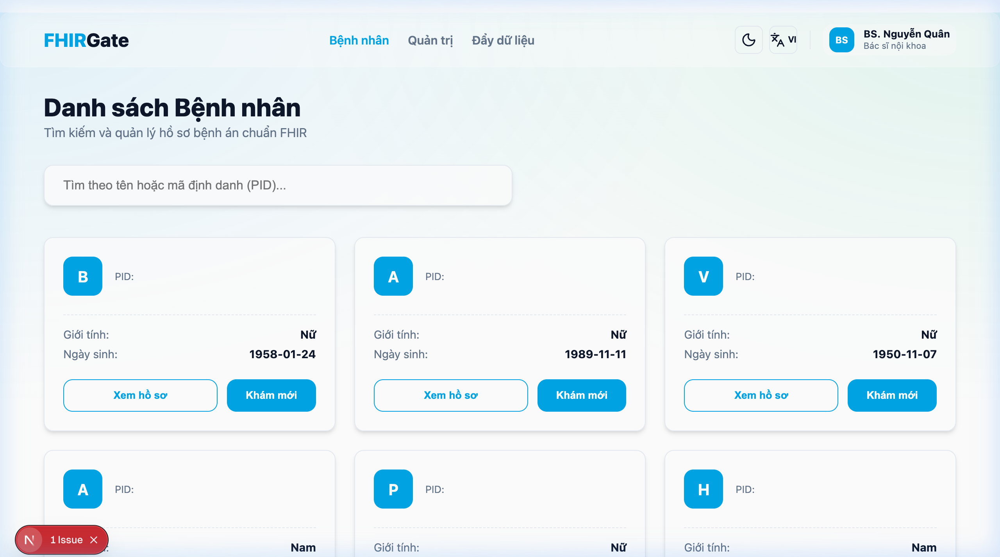
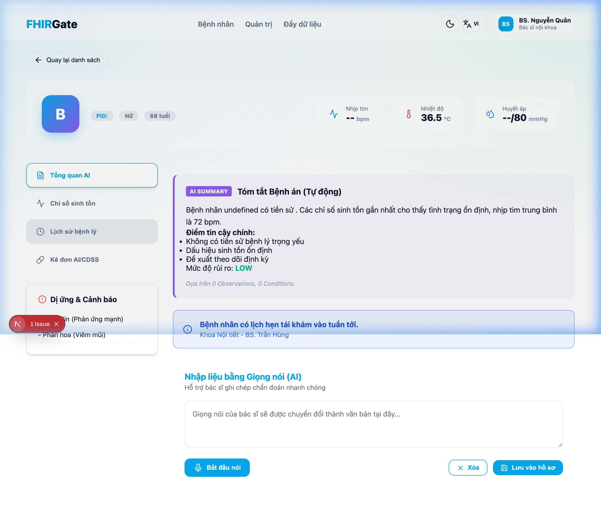

# [PROPOSAL] FHIRGate - Hệ Sinh Thái Quản Lý Dữ Liệu Y Tế Thông Minh

## 1. Tầm nhìn Sản phẩm (Executive Summary)

Trong bối cảnh dữ liệu y tế đang bị phân mảnh giữa các hệ thống EMR (Hồ sơ bệnh án điện tử) khác nhau, **FHIRGate** được xây dựng như một cổng kết nối tập trung, tuân thủ tiêu chuẩn quốc tế **HL7 FHIR R4**. 

FHIRGate không chỉ là một kho lưu trữ dữ liệu, mà là một **Hệ thống Hỗ trợ Ra quyết định Lâm sàng (CDSS)** tích hợp Trí tuệ Nhân tạo (AI), giúp bác sĩ tổng hợp hàng ngàn trang hồ sơ bệnh án chỉ trong vài giây.

---

## 2. Các Phân hệ Tính năng & Giao diện (UI/UX Modules)

### 2.1. Quản trị Hệ thống & Phân tích (Hospital Admin Dashboard)

Màn hình trung tâm dành cho lãnh đạo bệnh viện và quản trị viên hệ thống.
- **Tính năng chính**:
    - Theo dõi thời gian thực số lượng bệnh nhân, lượt khám, và các loại xét nghiệm.
    - Biểu đồ phân tích xu hướng dịch bệnh và tình trạng sức khỏe cộng đồng.
    - Kiểm soát trạng thái kết nối FHIR Server (HAPI FHIR, Microsoft FHIR, v.v.).
- **Giao diện**: Luxury Glassmorphism, Dark Mode hỗ trợ sự tập trung cao độ.

### 2.2. Danh mục Bệnh nhân Tập trung (Patient Central Registry)
Bộ lọc thông minh giúp tìm kiếm hồ sơ trong hàng triệu bản ghi.
- **Tính năng chính**:
    - Tìm kiếm theo Tên, Mã PID, hoặc Số định danh.
    - Phân loại bệnh nhân theo tình trạng sức khỏe và lịch sử thăm khám.
    - Khởi tạo quy trình khám mới (Ingestion/Registration) ngay tại chỗ.

### 2.3. Hồ sơ Bệnh án Thông minh (Clinical Intelligent Profile)

Trái tim của hệ thống, nơi bác sĩ trực tiếp tương tác với bệnh nhân.
- **Tính năng chính**:
    - **AI Clinical Summary**: Tự động đọc dữ liệu FHIR (Conditions, Observations, Meds) và đưa ra bản tóm tắt tình trạng bệnh, các điểm lưu ý chính và mức độ rủi ro (Risk Level).
    - **Vitals Monitoring**: Biểu đồ hóa các chỉ số sinh tồn (Nhịp tim, Huyết áp, SpO2) theo thời gian thực.
    - **CDSS Alert System**: Cảnh báo tức thời về tương tác thuốc hoặc các chỉ số xét nghiệm bất thường.
    - **Voice-to-Text Clinical Notes**: Hỗ trợ ghi chép bệnh án bằng giọng nói thông qua AI.

### 2.4. Trục Ingestion & Chuyển đổi Dữ liệu (Smart Data Ingestion)

Quy trình nạp dữ liệu từ các nguồn khác nhau vào chuẩn FHIR.
- **Tính năng chính**:
    - Chuyển đổi Batch từ CSV/Excel sang FHIR Resource.
    - Tự động nhận diện và phân loại Resource (Patient, Encounter, Lab result).

---

## 3. Quy trình Xử lý Nghiệp vụ (Workflows)

### 3.1. Luồng nạp và Lưu trữ dữ liệu (Data Ingestion Workflow)


### 3.2. Quy trình Phân tích AI (Clinical AI Reasoning)


---

## 4. Đặc tả Kỹ thuật (Technical Specifications)

- **Frontend Architecture**: Next.js 16 (App Router), TypeScript, Tailwind CSS with Glassmorphism.
- **Standard Protocol**: HL7 FHIR R4 (Standardized data interchange).
- **Core Library**: `fhir-client` / Custom Lightweight Fetch Wrapper.
- **AI Engine**: GPT-4o / Claude 3.5 Sonnet optimized for clinical terminology.
- **Database**: FHIR Server (HAPI/PostgreSQL) + Local Audit Logging.

---

## 5. Bảo mật & Tuân thủ (Security & Compliance)

FHIRGate được thiết kế theo các tiêu chuẩn bảo mật y tế nghiêm ngặt nhất:
- **Audit Logging**: Mọi hành động (TRUY CẬP, XÓA, SỬA hồ sơ) đều được ghi lại với Timestamp và User ID không thể thay đổi.
- **Data Privacy**: AI chỉ xử lý dữ liệu trong ngữ cảnh phiên làm việc và không lưu trữ thông tin nhận dạng bệnh nhân (PII) ra khỏi hệ thống nếu không được cấp phép.
- **Audit Flow**:
    ```json
    {
      "action": "READ",
      "resource": "Patient/123",
      "details": "Truy cập hồ sơ bệnh nhân Nguyễn Văn A",
      "timestamp": "2026-03-31T08:00:00Z"
    }
    ```

---

## 6. Lộ trình Phát triển (Roadmap)

### Giai đoạn 1: Hoàn thiện Core FHIR Portal (Hiện tại)
- Xây dựng hạ tầng kết nối FHIR Server tiêu chuẩn.
- Triển khai Dashboard quản trị và Danh mục bệnh nhân.
- Tích hợp AI Clinical Summary (Tóm tắt bệnh án thông minh).

### Giai đoạn 2: Tích hợp Telemedicine & CDSS nâng cao (Planned)
Phát triển hệ sinh thái tương tác thực tế giữa Bác sĩ - Bệnh nhân thông qua dữ liệu số:
- **Telemedicine Tích hợp**: Hỗ trợ thăm khám từ xa với chế độ "Context-aware Video Call" (Vừa gọi video vừa xem dữ liệu FHIR thời gian thực).
- **Hệ thống CDSS Nâng cao**: 
    - **Dự báo rủi ro**: Sử dụng AI để dự đoán nguy cơ tái nhập viện (Readmission Risk) và biến chứng mãn tính.
    - **Kiểm tra an toàn thuốc**: Tự động quét tương tác thuốc (DDI) và dị ứng dựa trên đơn thuốc thực tế.
- **AI-Driven Notes**: Tự động chuyển giọng nói bác sĩ thành dữ liệu Resource FHIR chuẩn (`ClinicalNote`, `Observation`).

### Giai đoạn 3: Hệ sinh thái IoT & Big Data (Future)
Chuyển đổi từ dữ liệu điểm (Point-in-time) sang dữ liệu dòng (Continuous stream) và phân tích quy mô lớn:
- **Medical IoT Integration**: 
    - Kết nối với các thiết bị đeo (Wearables) và thiết bị y tế gia đình (máy đo đường huyết liên tục - CGM, máy đo huyết áp thông minh).
    - Dữ liệu được đẩy trực tiếp vào các Resource `Observation` theo thời gian thực (Real-time FHIR Streaming).
- **Population Health Management (Quản lý sức khỏe cộng đồng)**: 
    - Phân tích dữ liệu lớn trên hàng triệu bệnh nhân để phát hiện sớm các ổ dịch hoặc xu hướng bệnh lý trong khu vực.
- **Precision Medicine (Y học chính xác)**: 
    - Kết hợp dữ liệu lâm sàng với dữ liệu di truyền (Genomic data) trên chuẩn FHIR để đưa ra phác đồ điều trị cá nhân hóa cực kỳ chính xác.
- **Clinical Research Platform**: 
    - Cung cấp dữ liệu đã được ẩn danh (Anonymized data) cho các đơn vị nghiên cứu lâm sàng và thử nghiệm thuốc, rút ngắn thời gian phát triển y học.

---

## 7. Giao diện Thực tế của Hệ thống (Actual System Interface)

Dưới đây là các hình ảnh trực tiếp từ phiên bản đang vận hành (Live Preview) của FHIRGate:

### 7.1. Bảng điều khiển Quản trị thực tế

*Hệ thống hiển thị các chỉ số sinh tồn và cơ cấu mặt bệnh thực tế từ dữ liệu FHIR.*

### 7.2. Quản lý Danh sách Bệnh nhân

*Giao diện tìm kiếm và phân loại bệnh nhân theo chuẩn mã định danh toàn cầu.*

### 7.3. Phân tích Lâm sàng AI (Live)

*Tính năng AI Summary đang thực hiện tóm tắt hồ sơ và đưa ra cảnh báo CDSS cho bác sĩ ngay trên giao diện web.*

---
**Liên hệ trình bày chi tiết**:  
*Dự án FHIRGate - Hệ thống y tế tương lai.*
